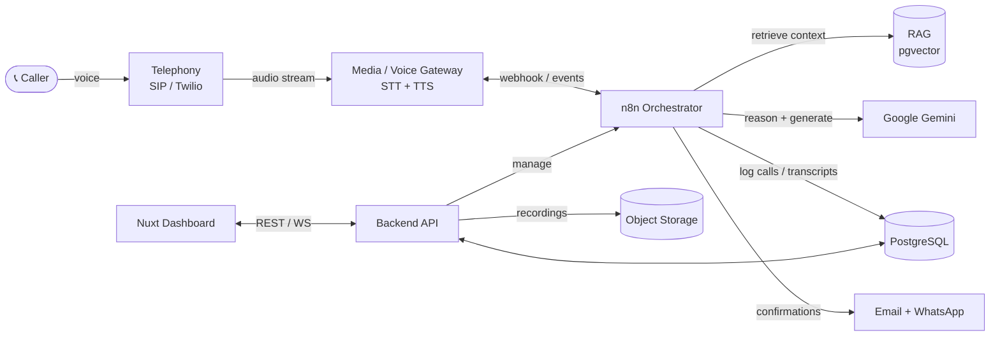

# AI Voice Call Agent Platform

> A multi-tenant, sector-agnostic **AI Voice Call Agent** built on **n8n** orchestration, **RAG** over **PostgreSQL/pgvector**, powered by **Google Gemini**, with a **Nuxt** admin & monitoring dashboard.

The platform lets any organization — a **hospital**, a **school**, a **restaurant**, or any other business — plug in a phone number (via **SIP** or **Twilio**), upload their own knowledge base, and have an AI agent answer calls, hold natural conversations, take actions (booking, appointments, reservations, enquiries), and send **confirmation messages over Email and WhatsApp**.

---

## What this repository contains (right now)

This repo currently holds the **complete development plan and architecture** for the platform. No application code has been written yet — this is the blueprint you build from.

| Document | What's inside |
|---|---|
| [`docs/00-overview.md`](docs/00-overview.md) | Vision, goals, personas, use cases per sector |
| [`docs/01-architecture.md`](docs/01-architecture.md) | High-level architecture + all system diagrams |
| [`docs/02-tech-stack.md`](docs/02-tech-stack.md) | Full stack with versions, why each choice was made |
| [`docs/03-call-flow.md`](docs/03-call-flow.md) | End-to-end call lifecycle (STT → RAG → LLM → TTS) |
| [`docs/04-n8n-workflows.md`](docs/04-n8n-workflows.md) | Every n8n workflow, node-by-node |
| [`docs/05-rag-pipeline.md`](docs/05-rag-pipeline.md) | Ingestion, chunking, embeddings, retrieval |
| [`docs/06-telephony.md`](docs/06-telephony.md) | SIP + Twilio + provider abstraction layer |
| [`docs/07-notifications.md`](docs/07-notifications.md) | Email + WhatsApp confirmation flows |
| [`docs/08-dashboard-nuxt.md`](docs/08-dashboard-nuxt.md) | Nuxt dashboard design, pages, components |
| [`docs/09-database-schema.md`](docs/09-database-schema.md) | Full PostgreSQL schema + ERD |
| [`docs/10-multitenancy.md`](docs/10-multitenancy.md) | How one platform serves many sectors/tenants |
| [`docs/11-security.md`](docs/11-security.md) | Auth, RLS, secrets, compliance (HIPAA/GDPR notes) |
| [`docs/12-roadmap.md`](docs/12-roadmap.md) | Phased build plan (MVP → v1 → scale) |

Start at [`docs/00-overview.md`](docs/00-overview.md) and read in order.

---

## The system at a glance

---

## Core capabilities

- 🎙️ **Live voice conversations** — barge-in, streaming STT and TTS, low latency.
- 🧠 **RAG-grounded answers** — every tenant uploads its own docs; the agent answers only from that knowledge base + configured tools.
- 🏥🏫🍽️ **Sector-agnostic** — templates for Hospital, School, Restaurant, and a generic base any business can extend.
- 🔌 **Provider-agnostic telephony** — connect SIP trunks or Twilio (and other providers) through one abstraction.
- 📊 **Full observability** — the Nuxt dashboard shows live n8n runs, call logs, **audio recordings playback**, and **full transcripts**.
- 📥 **Self-serve knowledge** — upload PDFs/text/FAQ, add custom Q&A, and manage what the agent knows, all from the dashboard.
- ✅ **Confirmations** — after a call the agent sends confirmation over **Email** and **WhatsApp**.

---

## Tech stack (summary)

| Layer | Technology |
|---|---|
| Orchestration | **n8n** (self-hosted, queue mode) |
| LLM | **Google Gemini** (`gemini-2.x` family) |
| Vector store | **PostgreSQL + pgvector** |
| Database | **PostgreSQL 16** |
| Dashboard | **Nuxt 3 (Vue 3)** + Nuxt UI / Tailwind |
| Realtime | WebSocket (Socket.IO / native) |
| Telephony | **Twilio** + **SIP** (Asterisk/FreeSWITCH or Twilio SIP) |
| STT / TTS | Deepgram / Google STT + Google / ElevenLabs TTS |
| Notifications | SMTP / Resend (Email) + WhatsApp Cloud API / Twilio WhatsApp |
| Object storage | S3-compatible (MinIO / AWS S3) for recordings |
| Infra | Docker Compose (dev) → Kubernetes (prod) |

See [`docs/02-tech-stack.md`](docs/02-tech-stack.md) for the full rationale.

---

## License

TBD.
