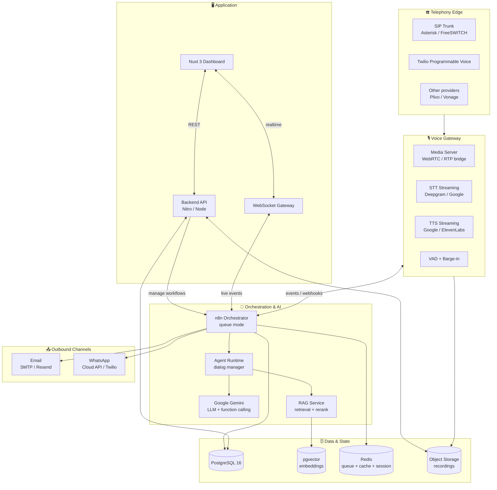
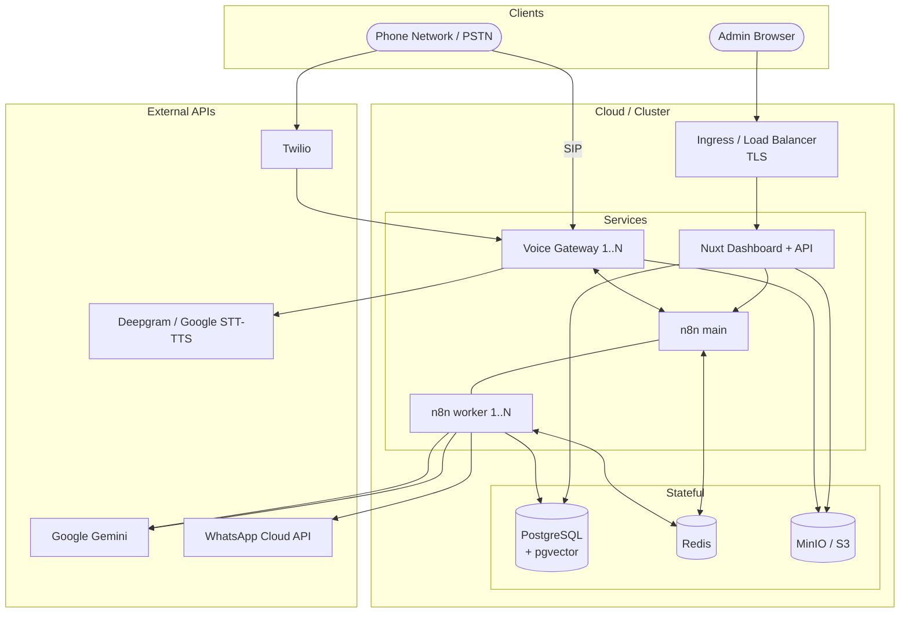
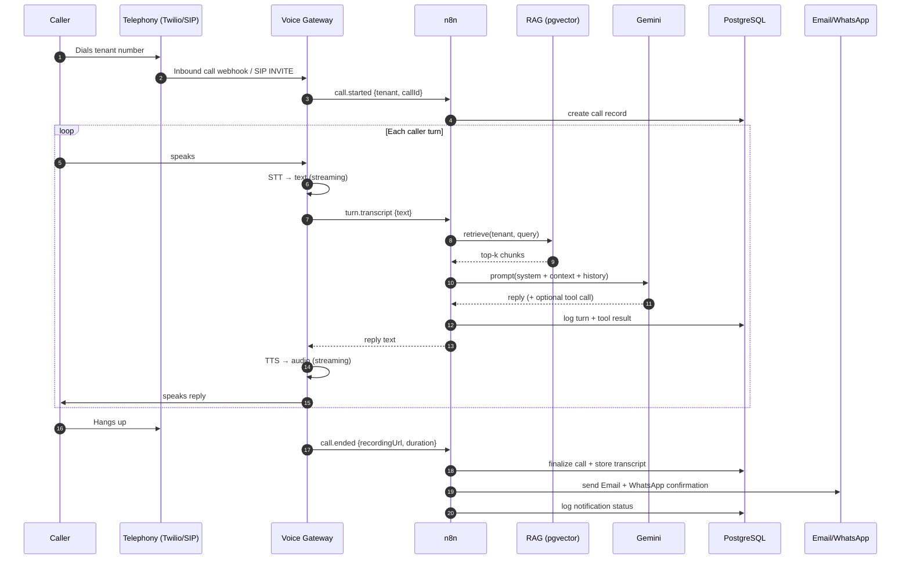

# 01 · System Architecture

This document is the heart of the plan: the high-level architecture and the diagrams that everything else refers back to.

---

## 1. Logical architecture (layered)



**Reading it top-down:** audio enters at the telephony edge, is turned into text by the voice gateway, orchestrated by n8n (which calls Gemini and RAG), persisted in PostgreSQL, and the results flow out as confirmations and up into the dashboard.

---

## 2. Component responsibilities

| Component | Responsibility | Tech |
|---|---|---|
| **Telephony edge** | Receive/place PSTN calls, expose SIP/webhooks | Twilio, Asterisk/FreeSWITCH |
| **Voice gateway** | Bidirectional audio ↔ text, VAD, barge-in, recording | Deepgram/Google STT, Google/ElevenLabs TTS, media server |
| **n8n orchestrator** | The workflow brain: routes events, calls services, logs, triggers notifications | n8n (self-hosted) |
| **Agent runtime** | Turn-by-turn dialog: build prompt, call RAG, call Gemini, decide tool calls | Node service (can live inside n8n Code nodes or a sidecar) |
| **Gemini** | Understand intent, generate replies, call functions (booking, escalation) | Google Gemini API |
| **RAG service** | Embed query, retrieve chunks, rerank, assemble context | pgvector + Gemini embeddings |
| **PostgreSQL** | Tenants, users, calls, transcripts, bookings, knowledge metadata | PostgreSQL 16 |
| **pgvector** | Vector similarity search over knowledge chunks | pgvector extension |
| **Redis** | n8n queue, session state, caching, rate limiting | Redis 7 |
| **Object storage** | Call recordings (audio files) | MinIO / S3 |
| **Backend API** | Dashboard's data + control plane | Nitro (Nuxt server) or standalone Node |
| **Nuxt dashboard** | Monitoring, knowledge management, config, playback | Nuxt 3 |
| **Notifications** | Email + WhatsApp confirmations | Resend/SMTP + WhatsApp Cloud API |

---

## 3. Why n8n as the orchestrator?

- **Visual + versioned** workflows the team can inspect and modify.
- Built-in nodes for HTTP, Postgres, Gmail/SMTP, and (via community/HTTP) Gemini, Twilio, WhatsApp.
- **Queue mode** with Redis scales workers horizontally for concurrent calls.
- Every execution is logged → the dashboard reads n8n's execution API for live monitoring.
- The **n8n MCP server** (available in this workspace) lets us build and manage workflows programmatically.

> n8n does *orchestration and side-effects*. The tight real-time audio loop (STT/TTS streaming) runs in the voice gateway for latency; n8n handles per-turn reasoning triggers, logging, bookings, and notifications.

---

## 4. Deployment topology



- **Dev:** single `docker-compose.yml` with all services.
- **Prod:** Kubernetes; n8n workers and voice gateways scale independently; managed Postgres recommended.

---

## 5. Repository / monorepo layout (target)

When code lands, the repo is planned as a monorepo:

```
n8n-Call-Agent-/
├── docs/                     # ← this plan
├── apps/
│   ├── dashboard/            # Nuxt 3 app (UI + Nitro API)
│   └── voice-gateway/        # Node service: STT/TTS/media bridge
├── packages/
│   ├── shared/               # Types, zod schemas, constants
│   ├── rag/                  # Ingestion + retrieval library
│   └── telephony/            # Provider abstraction (Twilio/SIP)
├── n8n/
│   ├── workflows/            # Exported workflow JSON (versioned)
│   └── credentials.example/  # Credential templates (no secrets)
├── db/
│   ├── migrations/           # SQL migrations
│   └── seed/                 # Sector template seeds
├── infra/
│   ├── docker-compose.yml
│   └── k8s/
└── .github/workflows/        # CI
```

---

## 6. Data flow summary (one call)



Full detail in [`03-call-flow.md`](03-call-flow.md).
