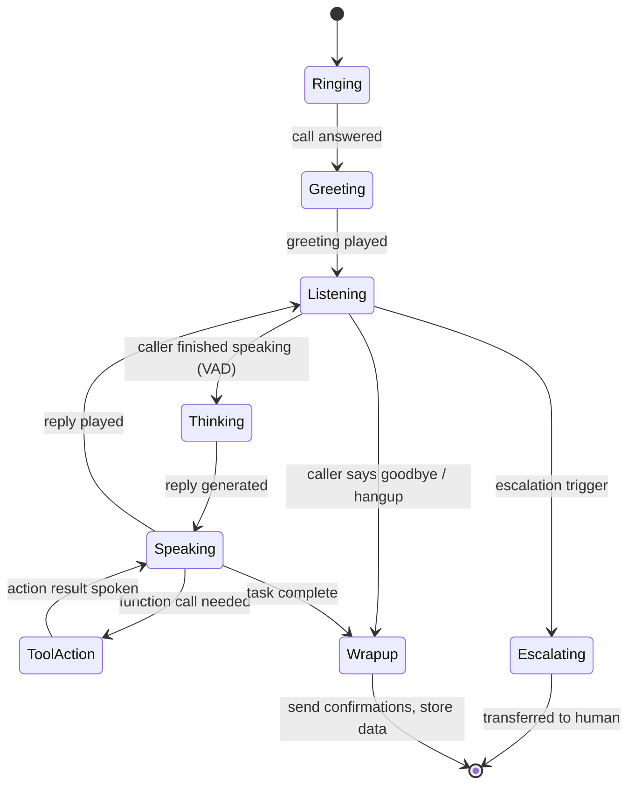
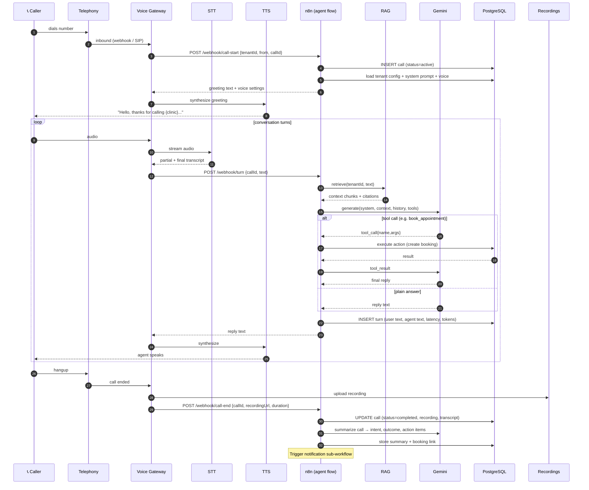

# 03 · Call Lifecycle (End-to-End)

How a single phone call moves through the system, turn by turn.

---

## 1. Phases of a call

---

## 2. Detailed sequence

---

## 3. Latency budget (per turn target)

To feel natural, aim for **< 1.5 s** from end-of-speech to start-of-reply-audio.

| Step | Target |
|---|---|
| VAD end-of-speech detection | ~200 ms |
| Final STT transcript | ~150 ms (streaming) |
| RAG retrieval | ~100 ms (pgvector HNSW) |
| Gemini flash first token | ~400–700 ms |
| TTS first audio chunk | ~200 ms |
| **Total to first audio** | **~1.0–1.4 s** |

Techniques: stream everything, start TTS on first sentence of the LLM output, cache tenant config, keep pgvector index warm, use Gemini flash.

---

## 4. Barge-in

If the caller starts speaking while the agent is talking:
1. VAD in the voice gateway detects speech energy.
2. Gateway **stops TTS playback immediately**.
3. Cancels the in-flight Gemini generation for that turn.
4. Starts a fresh STT capture.

This makes the conversation feel human, not like an IVR.

---

## 5. Escalation & safety

| Trigger | Action |
|---|---|
| Caller asks for a human | Transfer to configured number / queue |
| Emergency keywords (hospital template) | Immediate transfer + log priority flag |
| Agent low confidence / no RAG match | Offer callback or human transfer |
| Abuse / out-of-scope | Polite decline, end call, flag |

Escalation is a **first-class function call** the LLM can invoke, plus deterministic keyword rules in n8n as a safety net.

---

## 6. Outbound calls (later phase)

The same pipeline reversed: n8n triggers a call (reminder, follow-up), the voice gateway dials out via the telephony provider, and the agent runs a script (e.g. appointment reminder → confirm/reschedule). Covered in [`12-roadmap.md`](12-roadmap.md).
