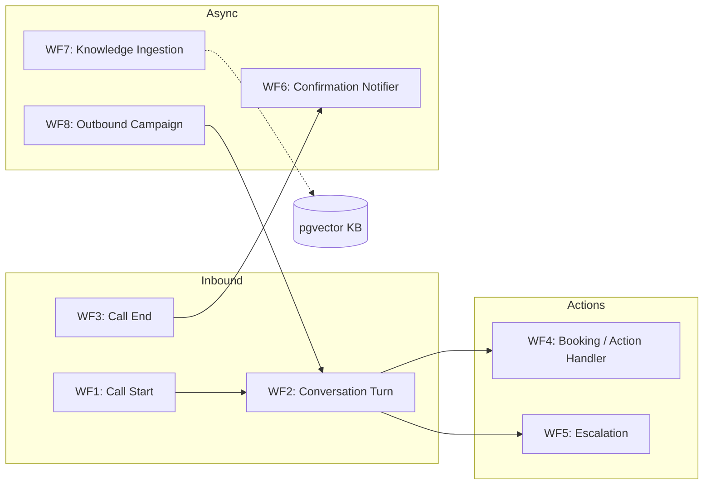
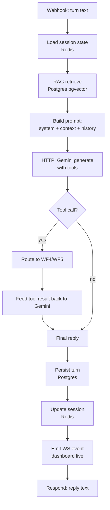
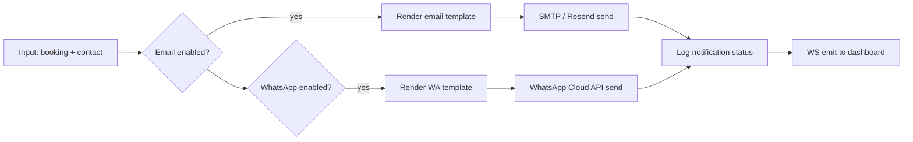

# 04 · n8n Workflows

The orchestration layer, workflow by workflow. All workflows are **tenant-aware** — every trigger carries a `tenantId` and loads that tenant's config first.

---

## 1. Workflow map

---

## 2. WF1 — Call Start

**Trigger:** Webhook `POST /webhook/call-start` (from voice gateway).

| # | Node | Purpose |
|---|---|---|
| 1 | Webhook | Receive `{tenantId, callId, from, to}` |
| 2 | Postgres | `INSERT INTO calls (...) status='active'` |
| 3 | Postgres | `SELECT` tenant config (prompt, voice, sector template, business hours) |
| 4 | IF | Within business hours? else play after-hours message |
| 5 | Set | Build greeting from template variables |
| 6 | Respond to Webhook | Return greeting + voice settings to gateway |

---

## 3. WF2 — Conversation Turn (the core loop)

**Trigger:** Webhook `POST /webhook/turn`.

Key details:
- **Session state** (history, collected slots like appointment date) kept in Redis keyed by `callId`.
- **Tools exposed to Gemini:** `search_knowledge`, `book_appointment`, `check_availability`, `make_reservation`, `capture_lead`, `transfer_to_human`, `end_call`. Tool set is filtered by sector template.
- Every turn emits a **WebSocket event** so the dashboard shows the conversation live.

---

## 4. WF3 — Call End

**Trigger:** Webhook `POST /webhook/call-end`.

| # | Node | Purpose |
|---|---|---|
| 1 | Webhook | `{callId, recordingUrl, durationSec}` |
| 2 | Postgres | Update call: status, duration, recording URL |
| 3 | Postgres | Assemble full transcript from turns |
| 4 | HTTP Gemini | Summarize: intent, outcome, sentiment, action items |
| 5 | Postgres | Store summary + structured outcome |
| 6 | Execute Workflow | Call **WF6 (Confirmation Notifier)** if a booking/lead was captured |
| 7 | WS emit | Notify dashboard the call finished |

---

## 5. WF4 — Booking / Action Handler

Invoked when Gemini calls a booking-type tool.

| Action | Steps |
|---|---|
| `check_availability` | Query `bookings` / external calendar → return free slots |
| `book_appointment` | Validate slot → `INSERT booking` → return confirmation id |
| `make_reservation` | Restaurant: validate party/time → `INSERT reservation` |
| `capture_lead` | School/generic: `INSERT lead` for follow-up |

Returns a structured result the LLM speaks back to the caller. Booking data is what the confirmation message (WF6) is built from.

---

## 6. WF5 — Escalation

| # | Node | Purpose |
|---|---|---|
| 1 | Trigger | From WF2 tool `transfer_to_human` or safety rule |
| 2 | Postgres | Flag call `escalated=true`, reason |
| 3 | Switch | Route by tenant: transfer number / queue / callback request |
| 4 | Respond | Tell gateway to bridge/transfer, or capture callback |
| 5 | Notify | Optionally alert staff (WhatsApp/email/Slack) |

---

## 7. WF6 — Confirmation Notifier

**Trigger:** Execute Workflow (from WF3) with `{tenantId, callId, booking}`.

- Channels toggled per tenant.
- Templates are sector-specific (appointment slip vs reservation card).
- Delivery status logged in `notifications` table and shown in dashboard.
- Detail: [`07-notifications.md`](07-notifications.md).

---

## 8. WF7 — Knowledge Ingestion (RAG)

**Trigger:** Webhook from dashboard when a tenant uploads a document or adds custom Q&A.

| # | Node | Purpose |
|---|---|---|
| 1 | Webhook | `{tenantId, documentId, source}` |
| 2 | HTTP / Code | Fetch file from object storage |
| 3 | Code | Extract text (PDF/DOCX/TXT/HTML) |
| 4 | Code | Chunk (see [`05-rag-pipeline.md`](05-rag-pipeline.md)) |
| 5 | HTTP Gemini | Embed each chunk (batch) |
| 6 | Postgres | `INSERT` chunks + vectors into `kb_chunks` |
| 7 | Postgres | Mark document `status='indexed'` |
| 8 | WS emit | Dashboard shows ingestion complete |

---

## 9. WF8 — Outbound Campaign (later phase)

Scheduled trigger → for each target, place an outbound call via the gateway and run WF2. Used for reminders and follow-ups.

---

## 10. Cross-cutting conventions

- **Idempotency:** webhooks carry a unique event id; dedupe in Redis.
- **Error handling:** each workflow has an error branch → log to `errors` table + alert.
- **Secrets:** stored in n8n credentials, never in workflow JSON committed to git.
- **Versioning:** workflows exported as JSON to `n8n/workflows/` and code-reviewed.
- **Building them:** use the **n8n MCP server** in this workspace to create/validate workflows programmatically (`get_workflow_sdk_reference` → `search_nodes` → `get_node_types` → build → `validate_workflow`).
