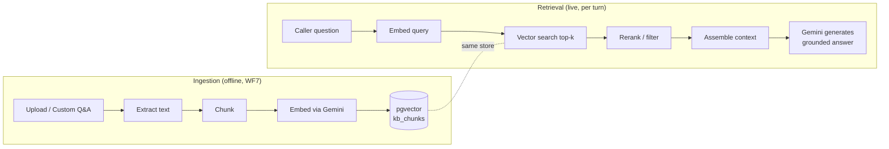

# 05 · RAG Pipeline

How each tenant's knowledge becomes grounded answers. RAG = **R**etrieval **A**ugmented **G**eneration.

---

## 1. Two halves: Ingestion & Retrieval



---

## 2. Ingestion

### 2.1 Sources
- Uploaded files: **PDF, DOCX, TXT, Markdown, HTML, CSV**.
- **Custom Q&A** entered directly in the dashboard (question + answer pairs).
- Structured data: menus, price lists, department directories (CSV/JSON).
- (Later) website crawl.

### 2.2 Text extraction
- PDF → `pdf-parse` / `unpdf`; DOCX → `mammoth`; HTML → readability + strip.
- Preserve headings and structure for better chunking.

### 2.3 Chunking strategy
- **Recursive character/semantic chunking**, ~500–800 tokens per chunk, ~15% overlap.
- Keep Q&A pairs as **single atomic chunks** (question + answer together).
- Attach metadata to every chunk: `tenant_id`, `document_id`, `source_title`, `section`, `sector`, `lang`.

### 2.4 Embeddings
- Gemini embedding model; batch chunks; store the vector in `kb_chunks.embedding vector(768|1536)`.
- Store the model name/version so re-embedding is possible on model upgrades.

### 2.5 Indexing
```sql
CREATE INDEX ON kb_chunks USING hnsw (embedding vector_cosine_ops);
```
Partitioned/filtered by `tenant_id` for isolation and speed.

---

## 3. Retrieval

### 3.1 Query flow (per conversation turn)
1. Take the caller's utterance (+ optionally a rewritten, context-aware query using recent history).
2. Embed the query with the same Gemini embedding model.
3. Vector search **within the tenant's chunks only**:
   ```sql
   SELECT content, source_title, 1 - (embedding <=> $1) AS score
   FROM kb_chunks
   WHERE tenant_id = $2
   ORDER BY embedding <=> $1
   LIMIT 8;
   ```
4. **Rerank / filter:** drop chunks below a score threshold; optionally rerank with a cross-encoder or Gemini scoring for top quality.
5. **Assemble context** with citations (source titles) into the prompt.

### 3.2 Hybrid search (recommended)
Combine vector search with keyword/full-text (`tsvector`) for names, codes, and exact terms (e.g. a specific doctor or dish name), then merge/rerank. pgvector + Postgres FTS makes this a single-database hybrid.

---

## 4. Grounded generation

The prompt to Gemini is structured:

```
SYSTEM: You are the voice assistant for {tenant_name}, a {sector}.
Answer ONLY from the CONTEXT. If the answer isn't there, say you'll
connect them to a human or take a message. Never invent facts.
Rules: {sector_rules}. Tone: {tone}. Language: match the caller.

CONTEXT:
[1] {chunk_1}  (source: {title})
[2] {chunk_2}  ...

CONVERSATION:
{recent history}

CALLER: {latest utterance}
```

- **Anti-hallucination:** explicit "answer only from context" + low temperature + escalation tool when no match.
- **Citations** are stored per turn so the dashboard can show *why* the agent said something.

---

## 5. Knowledge management (dashboard)

Tenant admins manage RAG entirely from the Nuxt dashboard ([`08-dashboard-nuxt.md`](08-dashboard-nuxt.md)):
- Upload / delete documents; see indexing status.
- Add / edit **custom Q&A** and "always say / never say" rules.
- Add **custom fields** and structured data (menus, departments, fees).
- Test the knowledge base with a "ask a question" playground that shows retrieved chunks + the answer.
- Re-index button when content changes.

---

## 6. Multi-tenant isolation

- Every `kb_chunks` row has `tenant_id`; queries always filter by it.
- **Row-Level Security** enforces it at the DB layer as a safety net ([`10-multitenancy.md`](10-multitenancy.md)).
- A tenant can *never* retrieve another tenant's chunks.

---

## 7. Quality & evaluation

- Log retrieval scores + whether the agent used context or escalated.
- Maintain a small **eval set** of question→expected-answer per sector; run on ingestion changes.
- Track "no-answer / escalation" rate as a knowledge-gap signal surfaced in the dashboard.
