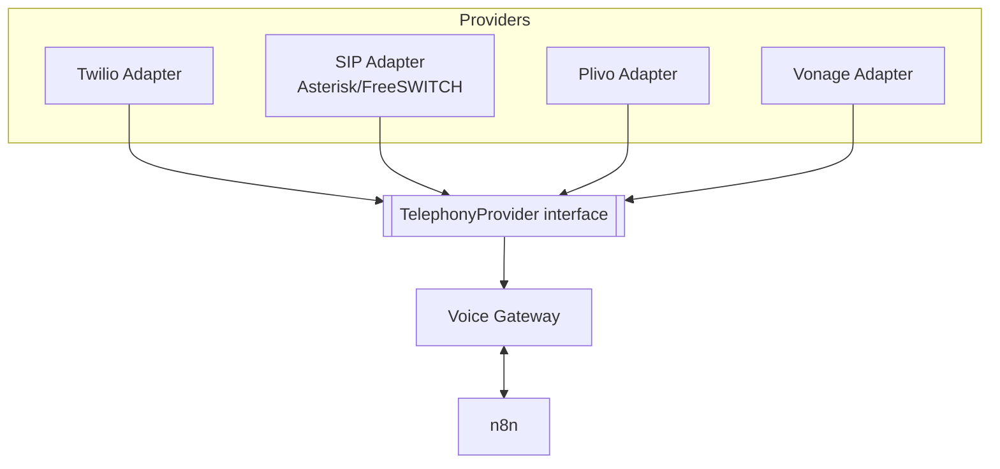
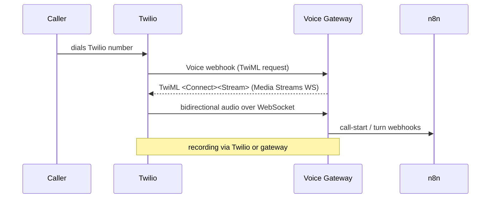

# 06 · Telephony Layer (SIP · Twilio · Others)

The platform must connect to phone networks through **multiple providers** without workflows caring which one is used.

---

## 1. Provider abstraction



A `TelephonyProvider` interface (in `packages/telephony/`) standardizes:

```ts
interface TelephonyProvider {
  onInboundCall(handler): void          // provider webhook/SIP INVITE -> normalized event
  answer(callId): Promise<MediaStream>  // open bidirectional audio
  playAudio(callId, chunk): void        // TTS out
  onAudio(callId, cb): void             // STT in
  transfer(callId, target): Promise<void>
  hangup(callId): Promise<void>
  startRecording(callId): void
}
```

Workflows and the voice gateway speak this interface; adding a provider = writing one adapter.

---

## 2. Twilio path (fastest to launch)



- **Twilio Media Streams** give raw audio over WebSocket → feed STT, receive TTS.
- Numbers, recordings, and even WhatsApp can all come from Twilio.
- Good for onboarding tenants who don't have their own trunk.

## 3. SIP path (own trunk / on-prem / lower cost)

- **Asterisk** or **FreeSWITCH** as the media server, or **Twilio SIP Trunking**.
- SIP INVITE → media server bridges RTP audio to the voice gateway (WebRTC/RTP).
- Suits tenants with existing PBX/SIP numbers or high call volume where per-minute SIP is cheaper.
- The SIP adapter normalizes events into the same `TelephonyProvider` interface.

## 4. Tenant number configuration (dashboard)

Each tenant, from the dashboard, can:
- **Bring a Twilio number** (enter Account SID / auth token or connect via subaccount).
- **Configure a SIP trunk** (host, username, password/registrar, codecs).
- Map a number → tenant + sector template.
- Set business hours, fallback/after-hours behavior, and transfer numbers.

Stored in the `phone_numbers` and `telephony_credentials` tables (secrets encrypted).

---

## 5. Audio & recording

- **Recording:** either provider-side (Twilio) or gateway-side (write RTP to file) → upload to object storage → URL stored on the call record.
- **Formats:** store as `mp3`/`opus`; keep per-channel if possible (caller vs agent) for cleaner transcripts.
- **Playback:** dashboard uses presigned URLs + WaveSurfer.js waveform.
- **Retention:** configurable per tenant; lifecycle rules on the bucket; consent + compliance per [`11-security.md`](11-security.md).

---

## 6. Concurrency & scaling

- Each voice gateway instance handles N concurrent calls (bounded by CPU + STT/TTS quotas).
- Scale gateways horizontally behind the load balancer.
- n8n workers scale independently for the reasoning/side-effect load.
- Redis tracks active-call sessions and enforces per-tenant concurrency limits.

---

## 7. Failure handling

| Failure | Behavior |
|---|---|
| STT/TTS provider down | Fail over to secondary provider; if none, play "please hold / try later" and take a message |
| Gemini timeout | Retry once fast; then fallback line + escalate |
| Provider webhook flood | Idempotency keys + rate limits |
| Recording upload fails | Retry queue; call still logged with transcript |
