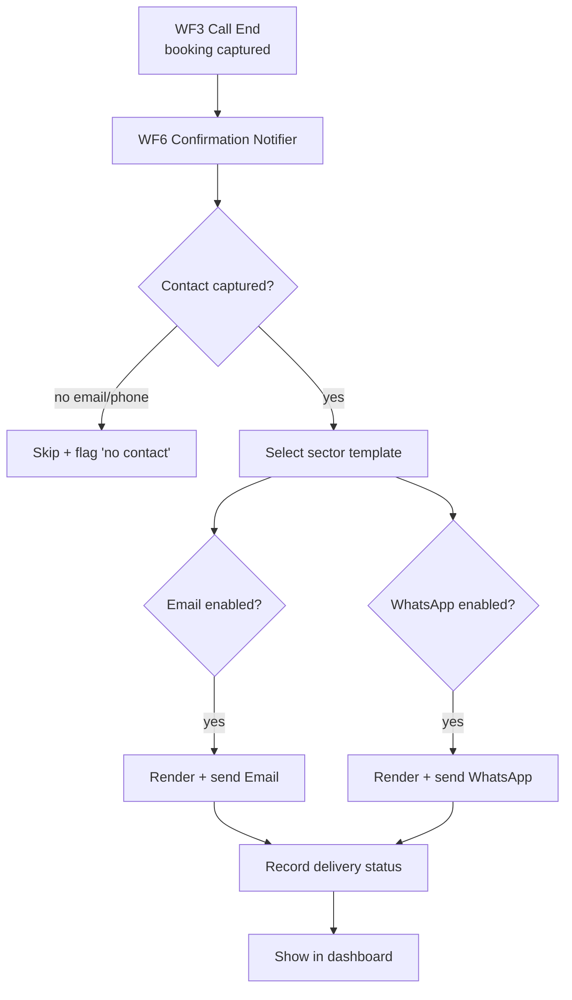

# 07 · Confirmations — Email & WhatsApp

After a call that results in a booking, reservation, or captured lead, the agent sends a **confirmation message** over **Email** and/or **WhatsApp**. Channels are toggled per tenant.

---

## 1. Flow

---

## 2. Email

| | |
|---|---|
| **Provider** | Resend (API) or SMTP via n8n Gmail/SMTP node |
| **Templates** | MJML → HTML, variables via Handlebars |
| **Content** | Confirmation details, calendar `.ics` attachment (appointments), tenant branding, reschedule/cancel link |
| **Deliverability** | SPF/DKIM/DMARC per tenant sending domain; per-tenant "from" address |

Example variables: `{caller_name, tenant_name, service, date, time, location, booking_id, reschedule_url}`.

---

## 3. WhatsApp

| | |
|---|---|
| **Primary** | **WhatsApp Cloud API** (Meta) |
| **Fallback** | Twilio WhatsApp |
| **Templates** | Pre-approved **message templates** (required for business-initiated messages) with named/positional variables |
| **Media** | Optional PDF slip / location pin |
| **Opt-in** | Capture consent during the call; store `whatsapp_opt_in` on the contact |

> WhatsApp business-initiated messages must use **approved templates**. Maintain one template per sector (appointment, reservation, enquiry) and per language.

---

## 4. Sector-specific templates

| Sector | Email + WhatsApp confirmation |
|---|---|
| 🏥 Hospital | "Appointment with Dr. {doctor} on {date} {time} at {dept}. ID {id}. Reply RESCHEDULE to change." + `.ics` |
| 🏫 School | "Campus visit / counselor call booked for {date} {time}. Brochure: {link}." |
| 🍽️ Restaurant | "Table for {party} on {date} {time} at {restaurant}. Ref {id}. Reply CANCEL to cancel." |
| 🧩 Generic | "Thanks {name}, we've noted your request: {summary}. We'll contact you at {phone}." |

Templates are editable in the dashboard and stored per tenant.

---

## 5. Delivery tracking

- Every send writes a `notifications` row: `channel`, `status`, `provider_message_id`, `error`.
- Webhooks from Resend / WhatsApp update status (`sent → delivered → read`).
- Dashboard shows per-call notification status with retry button.
- Failed sends go to a retry queue (exponential backoff).

---

## 6. Two-way (later phase)

- Inbound WhatsApp replies ("RESCHEDULE", "CANCEL") routed back into n8n to update the booking — closing the loop without a call.
- Email reply parsing for cancellations.

---

## 7. Compliance

- Respect opt-in/opt-out; store consent and timestamp.
- Include unsubscribe (email) and STOP handling (WhatsApp).
- No sensitive medical detail in message body beyond what the caller consented to (hospital sector) — see [`11-security.md`](11-security.md).
