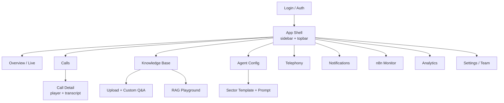
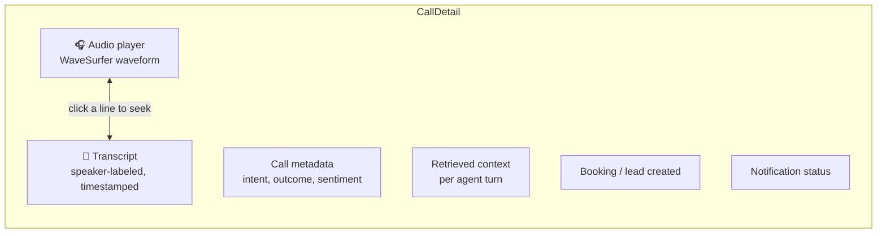
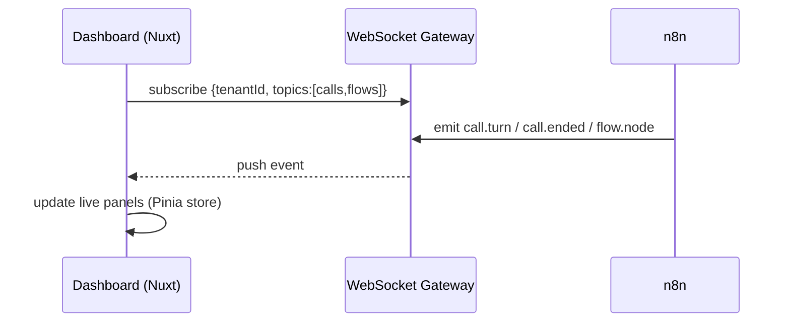

# 08 · Nuxt Dashboard

The control center: monitor n8n activity, **listen to recordings**, **read transcripts**, manage RAG knowledge, add custom details, connect telephony, and configure notifications — all self-serve.

---

## 1. Information architecture



---

## 2. Pages

### 2.1 Overview / Live
- KPI tiles: calls today, avg duration, resolution rate, escalations, cost.
- **Live calls panel** (WebSocket): active calls with a real-time transcript ticker.
- Recent activity feed.

### 2.2 Calls (list)
- Filter by date, sector, status, outcome, escalated, sentiment.
- Columns: caller, time, duration, outcome, booking, recording, notification status.
- Row → **Call Detail**.

### 2.3 Call Detail ⭐ (core requirement)

- **Recording playback** with waveform; click a transcript line to seek the audio to that moment.
- **Full transcript**, speaker-labeled (Caller / Agent), timestamps, and — expandable — the **RAG chunks** the agent used for each answer.
- Call summary (Gemini), detected intent, outcome, action items.
- Booking/reservation/lead created, and Email + WhatsApp confirmation status with resend.

### 2.4 Knowledge Base ⭐ (RAG management)
- **Upload** documents (PDF/DOCX/TXT/CSV) → shows indexing status live.
- **Custom Q&A** editor: add question→answer pairs the agent always knows.
- **Custom details / fields:** structured data (menus, departments, fees, doctors, timings) via forms or CSV.
- **"Always say / Never say"** rules and disclaimers.
- **RAG Playground:** type a question, see retrieved chunks + the answer the agent would give — test before going live.
- Re-index button; per-document delete.

### 2.5 Agent Config
- Pick **sector template** (Hospital / School / Restaurant / Generic) → seeds prompt, tools, templates.
- Edit system prompt, tone, languages, greeting, business hours, after-hours behavior.
- Choose voice (TTS) and STT language.
- Enable/disable tools (booking, reservation, lead capture, transfer).

### 2.6 Telephony
- Connect **Twilio** (SID/token or subaccount) or a **SIP trunk** (host/user/pass/codecs).
- Assign numbers → tenant/sector.
- Set transfer numbers, concurrency limits, recording on/off + retention.

### 2.7 Notifications
- Toggle Email / WhatsApp per tenant.
- Configure sender identity, connect WhatsApp Cloud API, manage approved templates.
- Edit sector templates with live preview + send-test.

### 2.8 n8n Monitor ⭐ (workflow observability)
- Live list of workflow executions (reads n8n's REST/execution API + WebSocket).
- Status per execution (success/error/running), duration, which workflow, which tenant.
- Drill into an execution → node-by-node view, inputs/outputs, errors.
- Error rate + retry from the dashboard.

### 2.9 Analytics
- Call volume over time, peak hours, intent breakdown, resolution vs escalation, knowledge-gap (no-answer) rate, cost per call, notification delivery rates.
- Charts via Chart.js/ECharts (follow the dataviz guidance).

### 2.10 Settings / Team
- Users, roles (platform admin, tenant admin, operator), invites.
- Tenant profile, branding, billing/usage.

---

## 3. Component & tech structure

```
apps/dashboard/
├── nuxt.config.ts
├── app.vue
├── layouts/          default (auth shell), blank (login)
├── pages/
│   ├── index.vue                 # Overview / Live
│   ├── calls/index.vue
│   ├── calls/[id].vue            # Call detail (player + transcript)
│   ├── knowledge/index.vue
│   ├── knowledge/playground.vue
│   ├── agent.vue
│   ├── telephony.vue
│   ├── notifications.vue
│   ├── flows.vue                 # n8n monitor
│   ├── analytics.vue
│   └── settings/*.vue
├── components/
│   ├── calls/AudioPlayer.vue     # WaveSurfer
│   ├── calls/Transcript.vue
│   ├── calls/RagContext.vue
│   ├── knowledge/Uploader.vue
│   ├── knowledge/QAEditor.vue
│   ├── flows/ExecutionList.vue
│   └── ui/*                      # tiles, charts, tables
├── composables/
│   ├── useAuth.ts
│   ├── useRealtime.ts            # WebSocket
│   ├── useCalls.ts
│   └── useTenant.ts
├── stores/ (Pinia)
│   ├── auth.ts
│   ├── tenant.ts
│   └── live.ts
└── server/                       # Nitro API
    ├── api/calls/[...].ts
    ├── api/knowledge/[...].ts
    ├── api/telephony/[...].ts
    ├── api/flows/[...].ts        # proxy to n8n
    └── middleware/auth.ts
```

---

## 4. Realtime (live monitoring)



- The `useRealtime` composable maintains the socket, dispatches into the `live` Pinia store.
- Backpressure: only subscribe to the current tenant's topics; paginate history via REST.

---

## 5. Auth & multi-tenant UX

- JWT session; every API call scoped to the user's `tenant_id`.
- Platform admins can switch tenants (tenant picker in topbar).
- Role-based visibility (operators can't edit telephony credentials, etc.).

---

## 6. Design system

- Nuxt UI + Tailwind; dark/light themes; responsive down to tablet (ops staff on the go).
- Follow the dataviz skill for all charts and stat tiles.
- Accessible: keyboard nav, labelled controls, audio player with captions (the transcript).
