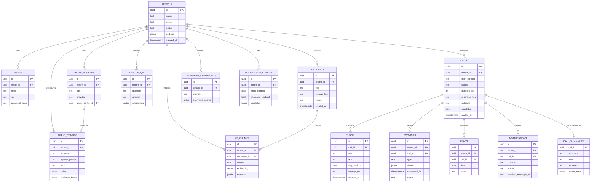

# 09 · Database Schema (PostgreSQL)

Single PostgreSQL 16 database with `pgvector`. Every domain table carries `tenant_id` and is protected by Row-Level Security ([`10-multitenancy.md`](10-multitenancy.md)).

---

## 1. Entity-Relationship Diagram



---

## 2. Core DDL (illustrative)

```sql
CREATE EXTENSION IF NOT EXISTS vector;
CREATE EXTENSION IF NOT EXISTS pgcrypto;

CREATE TABLE tenants (
  id          uuid PRIMARY KEY DEFAULT gen_random_uuid(),
  name        text NOT NULL,
  sector      text NOT NULL CHECK (sector IN ('hospital','school','restaurant','generic')),
  status      text NOT NULL DEFAULT 'active',
  settings    jsonb NOT NULL DEFAULT '{}',
  created_at  timestamptz NOT NULL DEFAULT now()
);

CREATE TABLE users (
  id            uuid PRIMARY KEY DEFAULT gen_random_uuid(),
  tenant_id     uuid NOT NULL REFERENCES tenants(id) ON DELETE CASCADE,
  email         text NOT NULL,
  role          text NOT NULL CHECK (role IN ('platform_admin','tenant_admin','operator')),
  password_hash text NOT NULL,
  created_at    timestamptz NOT NULL DEFAULT now(),
  UNIQUE (tenant_id, email)
);

CREATE TABLE agent_configs (
  id             uuid PRIMARY KEY DEFAULT gen_random_uuid(),
  tenant_id      uuid NOT NULL REFERENCES tenants(id) ON DELETE CASCADE,
  template       text NOT NULL,
  system_prompt  text NOT NULL,
  tools          jsonb NOT NULL DEFAULT '[]',
  voice          jsonb NOT NULL DEFAULT '{}',
  business_hours jsonb NOT NULL DEFAULT '{}',
  languages      text[] NOT NULL DEFAULT ARRAY['en']
);

CREATE TABLE phone_numbers (
  id              uuid PRIMARY KEY DEFAULT gen_random_uuid(),
  tenant_id       uuid NOT NULL REFERENCES tenants(id) ON DELETE CASCADE,
  e164            text NOT NULL UNIQUE,
  provider        text NOT NULL CHECK (provider IN ('twilio','sip','plivo','vonage')),
  agent_config_id uuid REFERENCES agent_configs(id)
);

CREATE TABLE documents (
  id          uuid PRIMARY KEY DEFAULT gen_random_uuid(),
  tenant_id   uuid NOT NULL REFERENCES tenants(id) ON DELETE CASCADE,
  title       text NOT NULL,
  storage_key text NOT NULL,
  status      text NOT NULL DEFAULT 'pending', -- pending|indexing|indexed|failed
  created_at  timestamptz NOT NULL DEFAULT now()
);

CREATE TABLE kb_chunks (
  id          uuid PRIMARY KEY DEFAULT gen_random_uuid(),
  tenant_id   uuid NOT NULL REFERENCES tenants(id) ON DELETE CASCADE,
  document_id uuid REFERENCES documents(id) ON DELETE CASCADE,
  content     text NOT NULL,
  embedding   vector(768) NOT NULL,
  metadata    jsonb NOT NULL DEFAULT '{}',
  tsv         tsvector GENERATED ALWAYS AS (to_tsvector('simple', content)) STORED
);
CREATE INDEX kb_chunks_embedding_idx ON kb_chunks USING hnsw (embedding vector_cosine_ops);
CREATE INDEX kb_chunks_tenant_idx    ON kb_chunks (tenant_id);
CREATE INDEX kb_chunks_tsv_idx       ON kb_chunks USING gin (tsv);

CREATE TABLE calls (
  id            uuid PRIMARY KEY DEFAULT gen_random_uuid(),
  tenant_id     uuid NOT NULL REFERENCES tenants(id) ON DELETE CASCADE,
  from_number   text,
  to_number     text,
  provider      text,
  status        text NOT NULL DEFAULT 'active', -- active|completed|failed|escalated
  duration_sec  int,
  recording_key text,
  outcome       text,
  escalated     boolean NOT NULL DEFAULT false,
  started_at    timestamptz NOT NULL DEFAULT now(),
  ended_at      timestamptz
);
CREATE INDEX calls_tenant_started_idx ON calls (tenant_id, started_at DESC);

CREATE TABLE turns (
  id            uuid PRIMARY KEY DEFAULT gen_random_uuid(),
  call_id       uuid NOT NULL REFERENCES calls(id) ON DELETE CASCADE,
  role          text NOT NULL CHECK (role IN ('caller','agent','system','tool')),
  text          text NOT NULL,
  rag_citations jsonb,
  tokens        int,
  latency_ms    int,
  audio_offset_ms int,           -- for click-to-seek in the transcript UI
  created_at    timestamptz NOT NULL DEFAULT now()
);

CREATE TABLE bookings (
  id            uuid PRIMARY KEY DEFAULT gen_random_uuid(),
  tenant_id     uuid NOT NULL REFERENCES tenants(id) ON DELETE CASCADE,
  call_id       uuid REFERENCES calls(id) ON DELETE SET NULL,
  type          text NOT NULL,   -- appointment|reservation|visit
  details       jsonb NOT NULL,
  scheduled_for timestamptz,
  status        text NOT NULL DEFAULT 'confirmed'
);

CREATE TABLE notifications (
  id                  uuid PRIMARY KEY DEFAULT gen_random_uuid(),
  tenant_id           uuid NOT NULL REFERENCES tenants(id) ON DELETE CASCADE,
  call_id             uuid REFERENCES calls(id) ON DELETE SET NULL,
  channel             text NOT NULL CHECK (channel IN ('email','whatsapp')),
  status              text NOT NULL DEFAULT 'queued', -- queued|sent|delivered|read|failed
  provider_message_id text,
  error               text,
  created_at          timestamptz NOT NULL DEFAULT now()
);
```

(Additional tables: `custom_qa`, `leads`, `call_summaries`, `telephony_credentials`, `notification_configs`, `errors`, `audit_log` follow the same pattern.)

---

## 3. Notes

- **Embedding dimension** (`vector(768)`) matches the chosen Gemini embedding model; adjust if you pick a different one.
- **Secrets** (`telephony_credentials.encrypted_secret`) encrypted with `pgcrypto` or app-level KMS — never plaintext.
- **`audio_offset_ms`** on turns enables click-a-line-to-seek in the Call Detail player.
- **Retention:** partition `calls`/`turns` by month for large volumes; lifecycle recordings in object storage.
- **Migrations** live in `db/migrations/` (e.g. via `drizzle-kit`, `node-pg-migrate`, or `prisma`).
