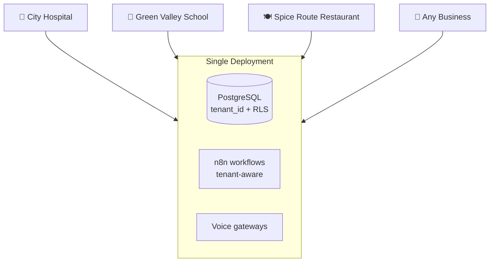
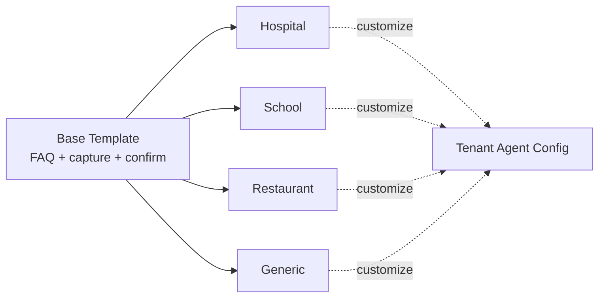
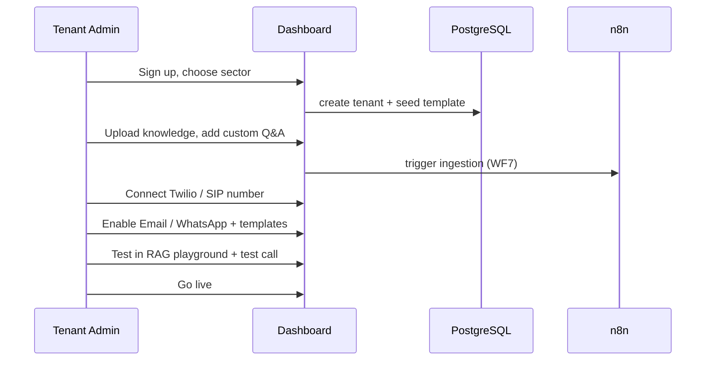

# 10 · Multi-Tenancy & Sector Templates

One platform, many organizations, many sectors — fully isolated, easily specialized.

---

## 1. Tenancy model

**Shared database, shared schema, `tenant_id` on every row + Row-Level Security.**



Chosen for simplicity and cost. High-compliance tenants (e.g. a hospital needing data residency) can later be moved to a **dedicated schema or database** — the code already scopes everything by `tenant_id`, so promotion is straightforward.

---

## 2. Isolation layers

| Layer | Mechanism |
|---|---|
| **Data** | `tenant_id` FK on every table + PostgreSQL **RLS** policies |
| **Vectors** | RAG queries filter `WHERE tenant_id = current_tenant` |
| **API** | JWT carries `tenant_id`; middleware sets it; no cross-tenant reads |
| **Workflows** | Every n8n trigger receives + validates `tenantId` |
| **Storage** | Recording keys namespaced `tenants/{id}/...`; presigned URLs scoped |
| **Secrets** | Per-tenant telephony/notification credentials, encrypted |

### RLS example
```sql
ALTER TABLE calls ENABLE ROW LEVEL SECURITY;
CREATE POLICY calls_tenant_isolation ON calls
  USING (tenant_id = current_setting('app.tenant_id')::uuid);
```
The API sets `SET app.tenant_id = '<uuid>'` per request/connection.

---

## 3. Sector templates

A **template** seeds a new tenant with sensible defaults; the tenant then customizes.



Each template defines:
- **System prompt** skeleton + tone.
- **Enabled tools** (hospital: appointments + emergency transfer; restaurant: reservations; school: lead capture + visit booking).
- **Safety rules** (hospital: no medical advice, escalate emergencies).
- **Notification templates** (appointment slip vs reservation card).
- **Sample knowledge structure** (departments/doctors vs menu vs courses/fees).
- **Default languages** (e.g. English + Malayalam for Kerala).

Stored as seed data in `db/seed/templates/` and applied on tenant creation.

---

## 4. Onboarding a new tenant



Fully self-serve; a non-technical manager can launch an agent without touching code.

---

## 5. Limits & fairness

- Per-tenant **concurrency caps** on active calls (Redis counters).
- Per-tenant **usage metering** (minutes, tokens, messages) for billing + quotas.
- Rate limits on ingestion and API to protect shared resources.
