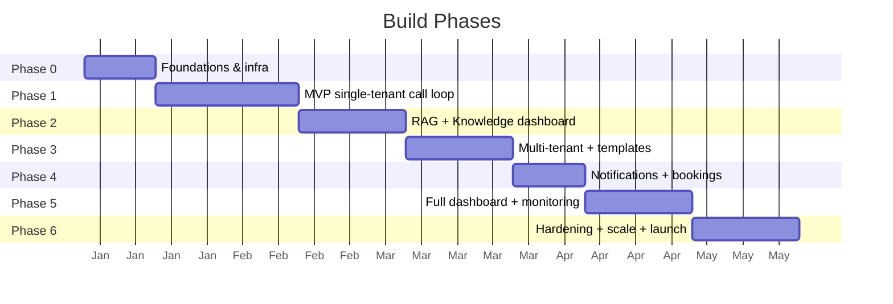

# 12 · Development Roadmap

A phased plan from empty repo → production-ready platform. Each phase is shippable and testable.

---

## Timeline overview

---

## Phase 0 — Foundations (≈2 weeks)
**Goal:** repo, infra, and a "hello world" across the stack.

- [ ] Monorepo scaffold (pnpm workspaces) per [`01-architecture.md`](01-architecture.md) layout.
- [ ] `docker-compose.yml`: PostgreSQL+pgvector, Redis, MinIO, n8n (queue mode).
- [ ] DB migrations tooling + initial schema ([`09-database-schema.md`](09-database-schema.md)).
- [ ] Nuxt app skeleton + auth + Nitro API health check.
- [ ] CI (GitHub Actions): lint, typecheck, test.
- [ ] Provision Twilio, Gemini, WhatsApp, STT/TTS accounts (sandbox).

**Exit:** all services boot; dashboard logs in; a Twilio test number reaches a stub webhook.

## Phase 1 — MVP call loop, single tenant (≈4 weeks)
**Goal:** talk to the agent on the phone.

- [ ] Voice gateway: Twilio Media Streams ↔ STT ↔ TTS, VAD, barge-in.
- [ ] n8n WF1/WF2/WF3 (call start / turn / end).
- [ ] Gemini integration (streaming, system prompt), no RAG yet (static FAQ).
- [ ] Record → object storage; store call + transcript.
- [ ] Minimal Call Detail page: play recording + read transcript.

**Exit:** dial the number, converse, hang up, see the call + recording + transcript in the dashboard. **← Core demo.**

## Phase 2 — RAG + knowledge management (≈3 weeks)
**Goal:** grounded answers from uploaded knowledge.

- [ ] WF7 ingestion; chunk + embed + store in pgvector.
- [ ] Retrieval in WF2; hybrid search; citations per turn.
- [ ] Dashboard: upload docs, custom Q&A, custom details, indexing status.
- [ ] RAG Playground (test questions, see chunks + answer).

**Exit:** upload a doc, ask about it on a call, get a grounded answer with citations visible in the dashboard.

## Phase 3 — Multi-tenant + sector templates (≈3 weeks)
**Goal:** many organizations, many sectors.

- [ ] `tenant_id` everywhere + RLS policies.
- [ ] Sector templates (Hospital/School/Restaurant/Generic) + seeds.
- [ ] Tenant onboarding flow; tenant picker; roles.
- [ ] Agent Config page (prompt, tools, voice, hours, languages).

**Exit:** create two tenants of different sectors; each has isolated data and its own behavior.

## Phase 4 — Bookings + notifications (≈2 weeks)
**Goal:** the agent completes tasks and confirms them.

- [ ] Gemini function calling: booking/reservation/lead tools (WF4).
- [ ] Escalation (WF5).
- [ ] Confirmation Notifier (WF6): Email + WhatsApp with templates.
- [ ] Delivery tracking + dashboard notification status + resend.

**Exit:** a call books an appointment/reservation and the caller gets Email + WhatsApp confirmation; status shows in dashboard.

## Phase 5 — Full dashboard + monitoring (≈3 weeks)
**Goal:** complete observability and management.

- [ ] Live calls panel (WebSocket) + live transcript ticker.
- [ ] n8n Monitor page (executions, node drill-down, errors, retry).
- [ ] Analytics (volume, intents, resolution, knowledge gaps, cost).
- [ ] Telephony page: connect Twilio **and SIP**; number mapping.
- [ ] Waveform player with click-to-seek transcript.

**Exit:** an admin can monitor everything live, manage numbers/knowledge/notifications end to end.

## Phase 6 — Hardening, scale & launch (≈3 weeks)
**Goal:** production-ready.

- [ ] Security pass ([`11-security.md`](11-security.md)): RLS audit, secrets, consent, audit log.
- [ ] Load test concurrent calls; scale gateways + n8n workers; k8s manifests.
- [ ] Failover for STT/TTS/LLM; retries; DR + backups.
- [ ] Sector compliance review (hospital especially).
- [ ] Docs, runbooks, onboarding guide. Beta with 1–2 real tenants.

**Exit:** production launch with monitoring, alerting, and real tenants.

---

## Later / stretch

- Outbound campaigns (reminders, follow-ups) — WF8.
- Two-way WhatsApp/email (reply to reschedule/cancel).
- More providers (Plivo, Vonage); on-prem SIP appliance.
- Analytics-driven knowledge-gap suggestions.
- Voice cloning / branded voices; more languages.
- Marketplace of sector templates.

---

## First concrete tasks (this week)

1. Approve this plan (adjust stack choices if needed).
2. Scaffold the monorepo + `docker-compose.yml` (Phase 0).
3. Stand up PostgreSQL+pgvector + run the initial migration.
4. Wire a Twilio sandbox number to a stub n8n webhook and confirm the round trip.

> Tip: the **n8n MCP server** in this workspace can build WF1–WF7 programmatically once Phase 0 infra is up.
